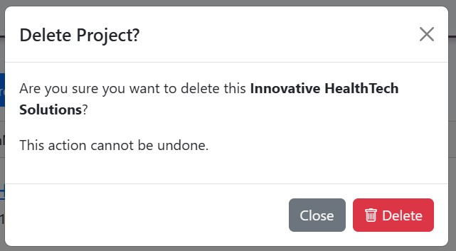

# ProManager

Visit the deployed site: [ProManager](https://pro-manager-10b4d100221c.herokuapp.com/)

Description

## CONTENTS

* [User Experience](#user-experience-ux)

* [Design](#design)

* [Technologies Used](#technologies-used)

* [Deployment & Local Development](#deployment--local-development)

* [Testing](#testing)
  
* [Credits](#credits)

- - -

## User Experience (UX)

### User Stories

#### Initial User Goals

#### Returning User Goals

#### Frequent User Goals

- - -

## Design

### Color Scheme

### Favicon

* A favicon in the browser tab.

  

### Typography

### Imagery

### Database ERM

### Wire-frames

### Project Author Features

#### The Home Page

#### First Time User Project Creation

#### Project Overview

#### Timeline View (Epics)

#### Board View (Tasks)

#### Task Manager

#### Teams

#### Future Implementations

### Accessibility

- - -

## Technologies Used

### Languages
- [Python](https://docs.djangoproject.com/en/5.1/releases/4.2.15/)
- [JS](https://www.javascript.com/)
- [HTML](https://developer.mozilla.org/en-US/docs/Web/HTML)
- [CSS](https://developer.mozilla.org/en-US/docs/Web/CSS)

### Frameworks
- [Django 5.1.2](https://docs.djangoproject.com/en/5.1/releases/5.1.2/)

### Databases
- [Code Institutes Postgresql](https://www.postgresql.org/)

### 3rd Party Imports
- [Pip](https://pypi.org/project/pip/)
- [allauth](https://docs.allauth.org/en/latest/)
- [summernote](https://pypi.org/project/django-summernote/)
- [crispy forms with boostrap 5](https://django-crispy-forms.readthedocs.io/en/latest/)
- [Gunicorn](https://gunicorn.org/)
- [whitenoise](https://whitenoise.readthedocs.io/en/stable/django.html)
- [sqlparse](https://pypi.org/project/sqlparse/) 
- [Psycopg2](https://pypi.org/project/psycopg2/)
- [oauthlib](https://oauthlib.readthedocs.io/en/latest/)
- [PyJWT](https://pyjwt.readthedocs.io/en/latest/)
- [asgiref](https://pypi.org/project/asgiref/)
- [dj-database-url](https://pypi.org/project/dj-database-url/)
- [python3-openid](https://pypi.org/project/python3-openid/)
- [requests-oauthlib](https://requests-oauthlib.readthedocs.io/en/latest/)
- [django-htmx](https://pypi.org/project/django-htmx/)
- [django-filter](https://pypi.org/project/django-filter/)

### Frameworks, Libraries & Programs Used

- [Figma](https://www.figma.com/) Used to create wire-frames.
- [Visual Studio Code](https://code.visualstudio.com/) Used as my primary IDE
- [Git](https://git-scm.com/) For version control.
- [Github](https://github.com/) To save and store the files for the website.
- [Google Fonts](https://fonts.google.com/) To import the fonts used on the website.
- [jQuery](https://jquery.com/) A JavaScript library.
- [HTMX](https://htmx.org/) To perform GET requests
- [BOOTSTRAP](https://getbootstrap.com/) for styling
- [Affinity](https://affinity.serif.com/en-gb/) To resize images and convert to webp format.
- [Am I Responsive?](http://ami.responsivedesign.is/) To show the website image on a range of devices.
- [dbdiagram.io](https://dbdiagram.io/home/) To Map out the models require to structure the database
- [PostgrSQL16 Admin](https://shields.io/) To visualize the database structure
- [Copilot](https://copilot.microsoft.com/) To create fictional use case and dat for testing

- - -

## Deployment

### Github Deployment

The website was stored using GitHub for storage of data and version control. To do this I did the following;

After each addition, change or removal of code, in the terminal within your IDE type:

- git add .
- git commit -m "meaningful commit message"
- git push

The files are now available to view within your github repository.

### Use CI Template

The CI template was cloned [CI Full Template](https://github.com/Code-Institute-Org/ci-full-template)

1. Follow the CI Full template link
2. On the right side click the button label 'Use this Template*
3. Select Create New Repository
4. Add a repository name and choose if you would like it public or private
5. Click on 'Create Repository'
6. The new repository is now created

### Github Desktop

Github desktop was used to create a local copy of this repository.

1. In the Github Desktop app select 'file'
2. Select 'clone repository'
3. Navigate to the Github tab and select the repository you created using the CI Template.
4. The repository will be loaded to your computer
    - You will be able to view any changes before you do your next commit.

### Heroku
Deployment to Heroku was completed using the following steps:

1. Update your requirements.txt file by entering entering the below into the terminal:
    - Run pip3 freeze > requirements.txt'.
    - Set debug to 'False' in the project settings
    - Commit and push the changes to Github.
2. Log in to Heroku and select New / Create new app.
    - Create an app name and select your region. 
    - Click Create App to continue.
3. Navigate to the Settings tab locate the ConfigVars section.
    - Click Reveal ConfigVars and add the following information:
    - KEY = 'DATABASE_URL', VALUE = Copy and paste the contents from the env.py file.
    - KEY = 'SECRET_KEY', VALUE = Add a confidential key/password set.
    - Click Add after entering each ConfigVar.
4. Within Settings, locate Buildpacks section.
    - Click Add Buildpack and add the following buildpacks:
    - Add Python and click Add Buildpack.
5. Go to Deploy tab and complete the deployment details.
    - Select GitHub as the Deployment Method.
    - Connect to GitHub and locate your repository and select Connect.
    - Select either to Automatic Deploy or Manual Deploy your and click Deploy Branch.
6. Once deployed, select open app to view the deployed project.

- The live link is [ProManager](https://pro-manager-10b4d100221c.herokuapp.com/)

- - -

## Testing

Please refer to [TESTING.md](TESTING.md) file for all testing carried out.

### Solved Bugs

### Known Bugs

- - -

## Credits

### Code Used

### Content

### Media

### Acknowledgments

